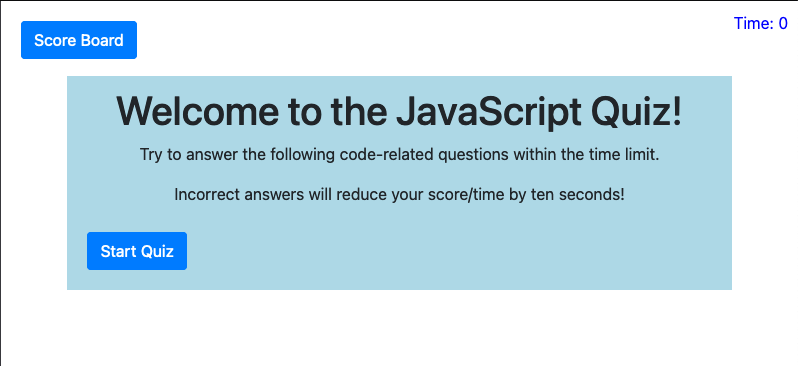

# 04-JavaScript Quiz

## The Project

This site is a work in progress that demonstrates knowledge of JavaScript, while quizzing the user on elements of JavaScript itself. As I continue to learn new features, I will add new questions related to them. 

<!-- screenshot 1 goes here -->

## Instructions

Click "Start Quiz" to begin. The timer begins ticking down and your score is determined by the time you have left. 

## Requirements

This website requires a web browser such as Safari, Firefox, Chrome, or Opera to view and run. 

## Credits

This site was built using Bootstrap: "Designed and built with all the love in the world by the Bootstrap team with the help of our contributors.

Currently v5.0.0-beta1. Code licensed MIT, docs CC BY 3.0."

## Contact

You may contact me at wrightsah@icloud.com.

## License

This project uses the following license: [MIT License](LICENSE)